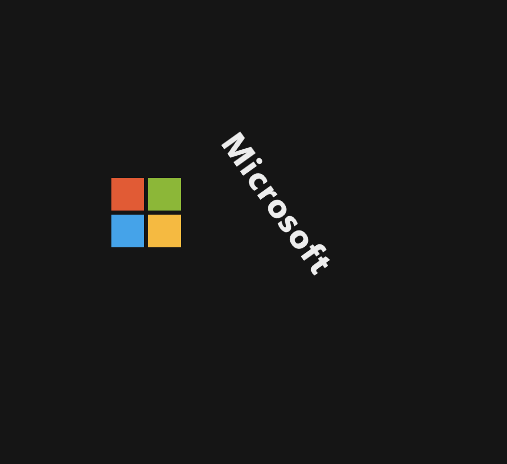
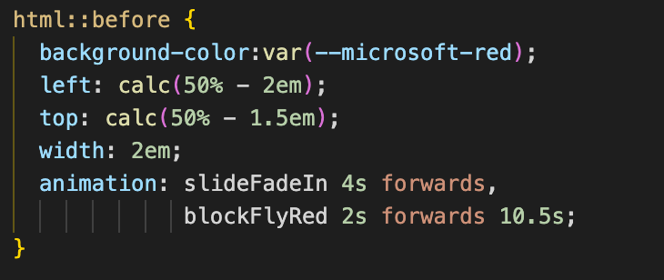

# Procesverslag
**Auteur:** Nigel Fijnheer

**De opdrachten:** [opdracht 1](opdracht1/index.html) en [opdracht 2](opdracht2/index.html)

Tijdens FvO ga ik beter worden in het schrijven van CSS. Voor opdracht 1 heb ik gekozen om het Microsoft logo na te gaan maken en er een animatie aan toe te voegen die bij het logo past.

## Bronnenlijst
  1. https://css-tricks.com/almanac/selectors/a/after-and-before/
  2. https://developer.mozilla.org/en-US/docs/Web/CSS/@keyframes
  3. -...-

## Opdracht 1 plan

  
uitwerken na schetsen idee (voor week 2)

  ### Je storyboard:
  

  ### Feedback
  Ik heb mijn storyboard laten zien aan mede studeten. De feedback die ik hier op gekregen had was dat er veel potentie in zat, maar dat er nog wel wat aan gedaan moet worden. Mijn conclusie is dat ik nog even verder ga met het bedenken van mijn animatie.

  ### Storyboard V2:
  

  ### Je ambitie: 
  Aan deze technieken/punten wil ik werken:
  - Het gebruik maken van before en after
  - Beter worden in het animeren in CSS
  - Door met alleen gebruik te maken van een H1 en span een werkende animatie en logo te maken
 

## Opdracht 1 reflectie

  
Afronden opdracht (week 4)

  ### Je uitkomst - karakteristiek screenshot(s):
  

  Voor het logo van Microsoft heb ik gekozen om alles een beetje om te laten vallen.

  ### Dit ging goed/Heb ik geleerd: 
  Tijdens dit project heb ik veel geleerd over CSS animaties, en heb geleerd hoe before en after nou precies werken. Ik wist voordat ik aan dit project ging werken niet dat je meerdere animaties kon toepassen op een element. Dit heb ik gebruikt bij de blokjes van Microsoft.

  

  ### Dit was lastig/Is niet gelukt:
  Ik heb het niet voor elkaar kunnen krijgen om de reduced motion toe te passen. 

  

  Wat ook niet gelukt is is om de animatie te blijven loopen. Als de animatie voorbij is gaat hij niet opnieuw

## Opdracht 2 plan

  
uitwerken na schetsen idee (voor week 5)

  ### Je ontwerp:
  

  ### Je ambitie: 
  Aan deze technieken/punten wil ik werken:
  - punt 1
  - punt 2
  - nog een punt
  - ...

## Opdracht 2 test

  
uitwerken na testen (week 7)

  Neem minimaal 5 bevindingen op:

  ### Bevinding 1:
  Omschrijving van wat er nog niet orde was (tekst en afbeeding(en)).

  #### oplossing:
  Beschrijving hoe je het hebt hebt opgelost of als het niet gelukt is hoe je het zou oplossen (tekst en afbeeding(en)).

  ### Bevinding 2:
  Omschrijving van wat er nog niet orde was (tekst en afbeeding(en)).

  #### oplossing:
  Beschrijving hoe je het hebt hebt opgelost of als het niet gelukt is hoe je het zou oplossen (tekst en afbeeding(en)).

  ### Bevinding 3:
  ...

## Opdracht 2 reflectie

  
uitwerken bij afronden opdracht (voor week 8)

  ### Je uitkomst - karakteristiek screenshot(s):
  

  ### Dit ging goed/Heb ik geleerd: 
  Korte omschrijving met plaatje(s)

  

  ### Dit was lastig/Is niet gelukt:
  Korte omschrijving met plaatje(s)

  

