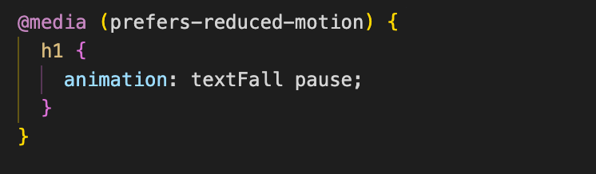

# Procesverslag
**Auteur:** Nigel Fijnheer

**De opdrachten:** [opdracht 1](opdracht1/index.html) en [opdracht 2](opdracht2/index.html)

Tijdens FvO ga ik beter worden in het schrijven van CSS. Voor opdracht 1 heb ik gekozen om het Microsoft logo na te gaan maken en er een animatie aan toe te voegen die bij het logo past.

## Bronnenlijst
  1. https://css-tricks.com/almanac/selectors/a/after-and-before/
  2. https://developer.mozilla.org/en-US/docs/Web/CSS/@keyframes
  3. https://developer.mozilla.org/en-US/docs/Web/JavaScript/Reference/Operators/this
  4. https://stackoverflow.com/questions/45498873/add-a-delay-after-executing-each-iteration-with-foreach-loop
  5. https://developer.mozilla.org/en-US/docs/Web/API/Element/remove
  6. https://developer.mozilla.org/en-US/docs/Web/JavaScript/Reference/Operators/Decrement
  7. https://css-tricks.com/snippets/css/complete-guide-grid/
  8. https://stackoverflow.com/questions/5915096/get-a-random-item-from-a-javascript-array
  9. https://developer.mozilla.org/en-US/docs/Web/JavaScript/Reference/Global_Objects/Array/sort

## Opdracht 1 plan

  
uitwerken na schetsen idee (voor week 2)

  ### Je storyboard:
  

  ### Feedback
  Ik heb mijn storyboard laten zien aan mede studeten. De feedback die ik hier op gekregen had was dat er veel potentie in zat, maar dat er nog wel wat aan gedaan moet worden. Mijn conclusie is dat ik nog even verder ga met het bedenken van mijn animatie.

  ### Storyboard V2:
  

  ### Je ambitie: 
  Aan deze technieken/punten wil ik werken:
  - Het gebruik maken van before en after
  - Beter worden in het animeren in CSS
  - Door met alleen gebruik te maken van een H1 en span een werkende animatie en logo te maken
 

## Opdracht 1 reflectie

  
Afronden opdracht (week 4)

  ### Je uitkomst - karakteristiek screenshot(s):
  

  Voor het logo van Microsoft heb ik gekozen om alles een beetje om te laten vallen.

  ### Dit ging goed/Heb ik geleerd: 
  Tijdens dit project heb ik veel geleerd over CSS animaties, en heb geleerd hoe before en after nou precies werken. Ik wist voordat ik aan dit project ging werken niet dat je meerdere animaties kon toepassen op een element. Dit heb ik gebruikt bij de blokjes van Microsoft.

  

  ### Dit was lastig/Is niet gelukt:
  Ik heb het niet voor elkaar kunnen krijgen om de reduced motion toe te passen. 

  

  Wat ook niet gelukt is is om de animatie te blijven loopen. Als de animatie voorbij is gaat hij niet opnieuw

## Opdracht 2 plan

  
uitwerken na schetsen idee (voor week 5)

  ### Je ontwerp:
  

  ### Je ambitie: 
  Aan deze technieken/punten wil ik werken:
  - Alle nummers van de bingo kaart moeten random zijn.
  - De balletjes moeten een voor een op het scherm komen.
  - Deze dingen wil ik oplossen met javascript.
  - Bingo kaart moet te kunnen bedienen zijn met toetsenbord
  - BINGO roepen als je klaar bent om het spelletje te winnen.

## Opdracht 2 test

  
uitwerken na testen (week 7)

  Neem minimaal 5 bevindingen op:

  ### Bevinding 1:
  De bingo kaart is niet te bedienen met toetsenbord.

  #### oplossing:
  Om de bingo te bedienen met het toetsenbord heb ik tabindex aan de list items toegevoegd. Op die manier kan je met je toetsenbord over de list items heen gaan. Ik ben daarbij begonnen bij 4 zodat de button eerst komen.
  

  ### Bevinding 2:
  Je kan geen nieuwe bingo kaart starten.

  #### oplossing:
  De knop om een bingo kaart te starten werkt maar een keer. De balletjes die komen word twee keer gedaan als je er nog een keer op klikt. Ik heb het niet voor elkaar gekregen om dit top te lossen. Ik heb geprobeerd om de Array leeg te maken waar de balletjes in zitten, maar dat heeft niet gewerkt.
  

   ### Bevinding 3:
  Je kan niet de vakjes aanklikken met het toetsenbord

  #### oplossing:
  Het toevoegen van de tabindex is niet genoeg om de vakjes ook echt te laten werken. Ik heb gebruik gemaakt van keypress event op de toets Enter om dit te laten werken.
  
  

  
  
  
   ### Bevinding 4:
  Geen light mode.

  #### oplossing:
  Mijn computer staat eigenlijk altijd op darkmode, dus ik moest dit nog omzetten naar light mode. Ik heb alle custom colors gezet in een prefers color scheme dark, en de root aangepast naar de light colors.
  
  
  
   ### Bevinding 5:
  Bingo roepen werkt niet altijd

  #### oplossing:
  Het roepen van bingo werkt niet altijd omdat de computer "bingo" of "Bingo" hoort. Dit zijn blijkbaar 2 verschillende dingen. Om dit op te lossen heb ik beide woorden toegevoegd aan de commands.
  
  

## Opdracht 2 reflectie

  
uitwerken bij afronden opdracht (voor week 8)

  ### Je uitkomst - karakteristiek screenshot(s):

  ### Dit ging goed/Heb ik geleerd: 
  Wat goed ging is het gebruik van javascript. Ik wist van te voren dat er veel met JS gedaan moest worden om dit in elkaar te zetten. Ik had nog niet heel veel ervaring hiermee, dus ik ben blij dat het meeste gelukt is. Ik heb geleerd hoe math.random en foreach loops werken. Dit heb ik gebruikt om de balletjes te genereren.

  ### Dit was lastig/Is niet gelukt:
  Ik vond het lastig om random nummers te krijgen in de vakjes. Eerst probeerde ik dat met volledig random nummers, maar ik heb uiteindelijk alle nummers in een array gezet, en daarvan random nummers gepakt. 
  
  Ook wat niet is gelukt is het starten van een nieuwe kaart. De knop nieuw werkt maar een keer. Als je er nog een keer op klikt gaat hij niet opnieuw lopen, maar twee keer.
  
  Uiteindelijk heeft het javascript me erg veel tijd gekost en heb daardoor niet alles visueel mooi kunnen maken. Ik had graag nog wat meer animaties en interacties willen toevoegen met het maken van een nieuwe kaart, maar dit is helaas niet gelukt. Ik ben wel blij dat het iets is geworden wat werkt. Er worden echt random nummers gemaakt, en de balletjes zijn ook elke keer anders.

  

